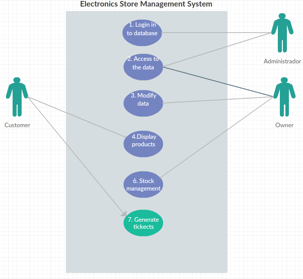

  <h1 align="center"> Universidad Autonoma de Ciudad Juarez</h3>
  <h2 align="center"> División Multidisciplinaria de Ciudad Universitaria </h3>
  <h3 align="center"> Departamento de Ingeniería Electricidad y Computación </h3>
  
</img>

  <h2>SRS Document: Process of Electronic Store</h3>
  <h3 align="center">By:Jorge Lozoya Acosta</h3>
  <h3 align="center">169868</h3>
  
# Table of contents
* [Introduction](#Introduction)
    - [Purpose](#Purpose)
    - [Scope](#Scope)
    - [Definitions, acronyms, and abbreviations](#Definitions-acronyms-and-abbreviations)
    - [References](#References)

* [Overrall description](#Overall-description)
    - [Business Managment Process](#Business-Managment-Process)
    - [Product perspective](#Product-perspective)
    - [Product Functions](#Product-functions) 
    - [Principal Actors](#Principal-Actors)
    - [User characteristics](#User-characteristics)
    - [Constrains](#Constrains)
    - [Assumptions and dependencies](#Assumptions-and-dependencies)
* [Specific requirements](#Specific-requirements) 
    - [User Interface](#User-Interface)
    - [Requirements](#requirements)
       - [Functional Requirements](#Functional-Requirements)
       - [Non functional Requirements](#Non-functional-Requirements) 
       - [System Requirements](#System-Requirements)
       - [User Requirements](#User-Requirements)
* [Appendices](#Appendices) 
   - [Elicitation process](#Elicitation-process)
    

# Introduction
## Purpose

Although this project has an academic focus, the chosen theme will help to understand the CRUD system (Create, Read, Update and Delete) and its requirements in a simpler way. In this document the role of the users and their interactions, requirements of the problem and its description will be detailed. A user interface will also be proposed and its limitations will be planed.

## Scope

"Electronics Store Management System " (ESMS) will be an application designed to be developed in Java with a database connection, where you can create, read, update and delete products from a store. It will have as data the name of the product, an ID and its price. Where the user will be able to consult said information

There are different users with different authority in the system, to which, not all users can access the data in the same way.

Although the project can be managed and designed to be commercialized, it will be more focused on an academic purpose.

## Definitions, acronyms, and abbreviations

## References

# Overall Description
## Business Managment Process
## Product Perspective

The system consists of an application for consultation and modification of data, therefore it is divided into two parts.
The application needs a constant communication with the database to retrieve the information in real time and thus show the current status of each product and be able to modify this state.

## Product functions

The main function of the system is to provide information to the user and the complete management of the system to the administrator. Thus making an application for the management of a electronics store.

| Class of use cases|Use cases| Description of uses cases|
| ------------- |-------------| -----|
|**Use case related to Installation**   |Installation   |Software pre-installed on a tablet |
|**Use cases related to product database**|Login to the product database| Login into to system |
|| Change IDs| Can change Product's ID|
|| Update inventory | Update purchased and received products |
|| Rename Products | Be able to modify the name of the products|
|**Use cases related to purchases**| Display the price|Show the price of any product|
||Enable purchases in only available products | The client only can buy the available products|
||Do not allow the purchase of stockouts| The client may see the product but can't buy it|
|**Use cases related to securities**|Generate tickets|A ticket is generated to pay at the cashier|
||No purchases allowed from the application |The application will not accept any payment method|
|**Use cases related to alert**|Generate empty inventory alert|When a product is not available, an alert will be sent|
||Show alerts|Show all the pending alerts|

## Principal Actors
The two principal actors in ESMS are "user" and "system".

## User characteristics

There are four types of users: the end user, the administrator, employer and the owner of the electronics store. Each of them has different use cases and therefore each one has different characteristics in the requirements.

| User| Description|
| ------------- |:-------------:| 
| Customers | Has waiting times when making the purchase and interacts with the selling employees      |
| Risk Department| It is the intermediary between the management of resources and suppliers | 
| Sale Manager | He is in charge of reviewing the inventory and buying from suppliers |
| Sale Employers |They can make product delete and update the data|

## Constraints
The different interfaces that are needed can become a restriction due to the difficulty of adapting. Since it opens a difference of navigation depending on the type of user.

The hardware can be an impediment due to the high cost it can generate for a electronics store.

If you want the end user to search for the product, you need a more functional interface that is face-to-face / physical.

## Assumptions and dependencies
| AS (Assumption) DE(Dependencies)| Description |
| ------------- |:-------------:| 
| AS-1:| Maybe a product is not available  |
| AS-2:| The final interface will be a tablet application.| 
| DE-1:| Internet Connection |
| DE-2:| Electricity for final device|

# Specific requirements

## User Interface
Here you will see all the details about the inputs and outputs that have been planned for the system. There will also be a description of hardware, software and its communication between interfaces and a basic prototype of the user interface is also provided.

## Requirements

### Functional Requirements
**A general use case**

We describe the funtional requirements by giving various use cases.

 *Use case related to installation:*

 **Use Case 1:** Installation

 *Primary Actor*: Owner

 *Pre Condition*: Have a tablet with ESMS, Pre-made database

 *Main Scenario:*
 1. The store owner turns on the system.
 2. System asks for the dicrectoy of the database.
 3. The owner specifies where is the directory and access.
 4. The system shows a success message
 
 *Alternate Scenario:*
 3(a). Don't find the directory
 
  *Use case related to product database:*

 **Use Case 2:** Login to the product database

 *Primary Actor*: Administrador

 *Pre Condition*: Have the password, database already installed

 *Main Scenario:*
 1. The administrator logs into the database
 2. Makes the necessary changes
 3. Leave the system open for the owner
 
 **Use Case 3:** Change IDs
 *Primary Actor*: Administrador
 
 *Pre Condition*: Already login in to database
 
 *Main Scenario:*
 1. Login
 2. Search the product to change
 3. Make the ID change and save
 
 *Alternate Scenario:*
 2(a). Don't find the product
 
 2(a)1. ID change abort.
 
  **Use Case 4:** Update inventory
 *Primary Actor*: Owner and Employers
 
 *Pre Condition*: Have new inventory or some product was sold
 
 *Main Scenario:*
 1. Search the product to be modified
 2. Increase or eliminate the new quantity
 3. Save changes
 
 *Alternate Scenario:*
 2(a). Unable to access the system
 
 2(a)1. Call the administrator.
 
  **Use Case 5:** Rename Products
 *Primary Actor*: Owner
 
 *Pre Condition*: Access to the database
 
 *Main Scenario:*
 1. Login in mode Owner
 2. Search the product
 3. Change the name
 4. Save
 
 *Alternate Scenario:*
 2(a). Unable to access the system
 
 2(a)1. Call the administrator.

*Use case related to purchases:*

 **Use Case 6:** Display the price

 *Primary Actor*: Customer 

 *Pre Condition*: Have the application open on the tablet 

 *Main Scenario:*
 1. The client looks for a product.
 2. The app shows different results.
 3. The customer chooses one.
 4. The app displays the price.
 
 *Alternate Scenario:*
 1(a). Don't find the product.
 
 1(a)1. The system must show various alternatives to the product.
 
 **Use Case 7:** Enable purchases in only available products

 *Primary Actor*: Customer

 *Pre Condition*: Success in display the price 

 *Main Scenario:*
 1. The client looks for a product.
 2. The app shows different results.
 3. The customer chooses one.
 4. The app displays the price and open a menu.
 5. Show how many product the store have.
 
 *Alternate Scenario:*
 2(a). Don't find the product.
 
 2(a)1. The system must show various alternatives to the product.
 
 **Use Case 8:** Do not allow the purchase of stockouts

 *Primary Actor*: Customer

 *Pre Condition*: Success in display the price 

 *Main Scenario:*
 1. The client looks for a product.
 2. The app shows different results.
 3. The customer chooses one.
 4. The app displays the price and do not open a menu if there no stock.
 
 *Alternate Scenario:*
 2(a). Don't find the product.
 
 2(a)1. The system must show various alternatives to the product.
 
 *Use case related to securities:*

 **Use Case 9:** Generate tickets

 *Primary Actor*: Customer 

 *Pre Condition*: The customer want to purchase a product 

 *Main Scenario:*
 1. The client looks for a product.
 2. The app shows different results.
 3. The customer chooses one.
 4. The app displays the price and open a menu.
 5. Show how many product the store have.
 6. The customer wants to buy a certain amount of product
 7. The system will set aside the amount desired by the client and generate a ticket to pay in cash
 
 *Alternate Scenario:*
 1(a). Don't find the product.
 
 1(a)1. The system must show various alternatives to the product.
 
 **Use Case 10:** No purchases allowed from the application

 *Primary Actor*: Customer 

 *Pre Condition*: The customer want to purchase a product 

 *Main Scenario:*
 1. The client looks for a product.
 2. The app shows different results.
 3. The customer chooses one.
 4. The app displays the price and open a menu.
 5. The system warns that no purchases are allowed from the application. Only set aside by means of tickets
 6. Show how many product the store have.
 7. The customer wants to buy a certain amount of product

 
 *Alternate Scenario:*
 1(a). Don't find the product.
 
 1(a)1. The system must show various alternatives to the product.
 
 *Use case related to alert:*

 **Use Case 11:** Generate empty inventory alert

 *Primary Actor*: System

 *Pre Condition*: Connect to the database

 *Main Scenario:*
 1. The system verifies the quantity of products that it has
 2. If a product has 3 or less, the system will create an alert.
 3. If a product has 0, the system will disable the product
 
 *Alternate Scenario:*
 1(a). Don't find any the product without stock.
 
 1(a)1. Do nothing.
 
 **Use Case 12:** Show alerts

 *Primary Actor*: System

 *Pre Condition*: Have alerts

 *Main Scenario:*
 1. The system verifies the alerts that it has
 2. If the system has 3 or more alerts, the system will send a messege to the owner.
 3. The owner can check each one of the alerts that exist.

## Non-Functional Requirements
## System Requirements
## User Requirements

# Appendices
## Elicitation Process

*Interview: First day*

**Interviewer:** What kind of processes exist here?

**John Smith(owner):** Well, first of all, the products come from different suppliers.

**Interviewer:** Who is the person in charge of the inventory?

**Owner:** We have a manager. He is in charge of inventory and employees.

**Interviewer:** Who else has access to the inventory?

**Owner:** Oh, the system allows employees to remove a product from inventory by selling it

*Inverview: Second day*

**Interviewer:** Well, how long do customers usually wait in their lines?

**Owner:** About half an hour, although normally we do not have that problem

**Interviewer:** So what is the problem?
 
**Owner:** When a customer buys a product, there is the possibility of not having it in stock.Then we see if the product is in the cellar.

**Interviewer:** What happens if you do not have it in the cellar?

**Owner:** Oh, we notify you that the product asks the customer does not have it and we send a request to the risk department
