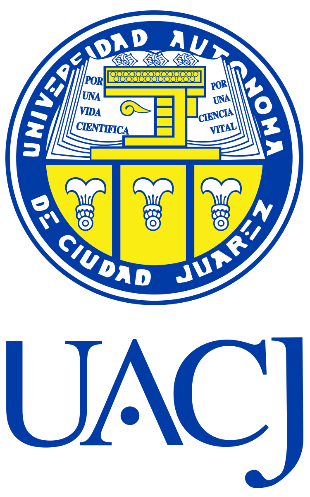
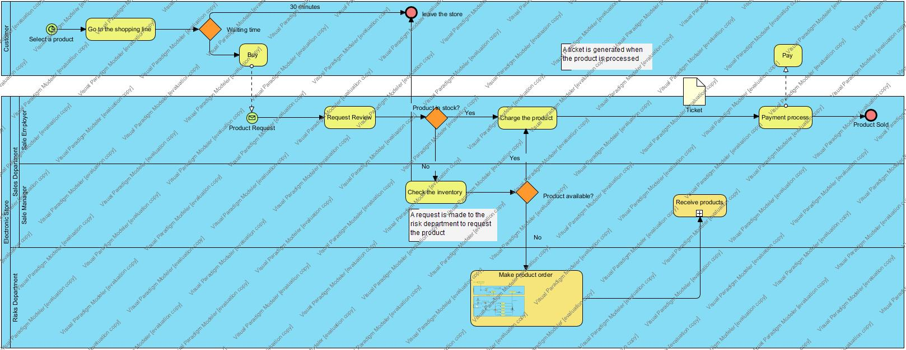
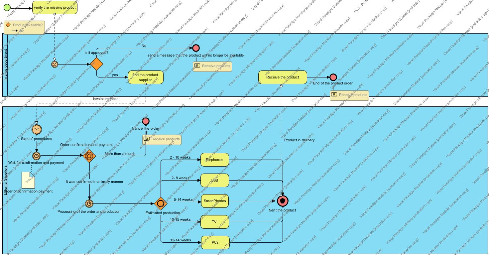
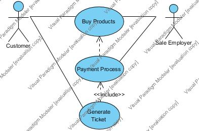
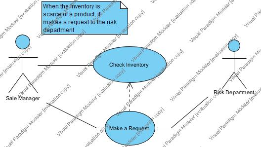
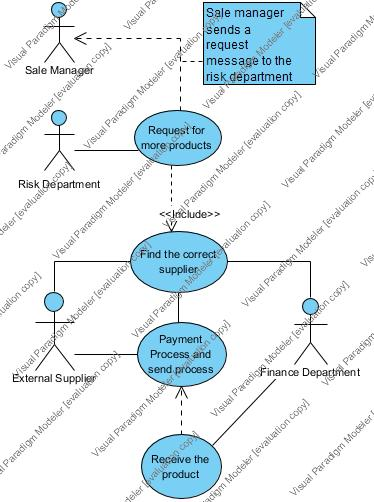
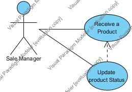

  <h1 align="center"> Universidad Autonoma de Ciudad Juarez</h3>
  <h2 align="center"> División Multidisciplinaria de Ciudad Universitaria </h3>
  <h3 align="center"> Departamento de Ingeniería Electricidad y Computación </h3>
  
</img>

  <h2>SRS Document: Process of Electronic Store</h3>
  <h3 align="center">By:Jorge Lozoya Acosta</h3>
  <h3 align="center">169868</h3>
  
# Table of contents
* [Introduction](#Introduction)
    - [Purpose](#Purpose)
    - [Scope](#Scope)
    - [Definitions, acronyms, and abbreviations](#Definitions-acronyms-and-abbreviations)
    - [References](#References)

* [Overrall description](#Overall-description)
    - [Business Managment Process](#Business-Managment-Process)
    - [Product perspective](#Product-perspective)
    - [Product Functions](#Product-functions) 
    - [Principal Actors](#Principal-Actors)
    - [User characteristics](#User-characteristics)
    - [Constrains](#Constrains)
    - [Assumptions and dependencies](#Assumptions-and-dependencies)
* [Specific requirements](#Specific-requirements) 
    - [User Interface](#User-Interface)
    - [Requirements](#requirements)
       - [Functional Requirements](#Functional-Requirements)
       - [Non functional Requirements](#Non-functional-Requirements) 
       - [System Requirements](#System-Requirements)
       - [User Requirements](#User-Requirements)
* [Appendices](#Appendices) 
   - [Elicitation process](#Elicitation-process)
    

# Introduction
## Purpose

Although this project has an academic focus, the chosen theme will help to understand the CRUD system (Create, Read, Update and Delete) and its requirements in a simpler way. In this document the role of the users and their interactions, requirements of the problem and its description will be detailed. A user interface will also be proposed and its limitations will be planed.

## Scope

"Electronics Store Management System " (ESMS)is an application that simulates the processes carried out in a specialized store, where you can create, read, update and delete products from a store. It will have as data the name of the product, an ID and its price.

Different users interact in different ways, each one has activities that influence the flow of the process.

Although the project can be managed and designed to be commercialized, it will be more focused on an academic purpose.

## Definitions, acronyms, and abbreviations
- ESMS Electronics Sotre Managment System
## References

# Overall Description
## Business Managment Process
For the bussiness Managment Pocess, it will be planned as shown in the following figure, where it was designed from the [elicitation process](#Elicitation-process)
 ### Main BMP Diagram
 
 
 * Here you can see how the process of an electronic store is deployed with the main process of buying and selling products.
 * You can also see the interaction between the internal and external users of the process, with the main external suppliers.

* 

Throughout this process (Make orders) you can see the path a product takes to be received in the store. All procedures that are carried out to confirm purchases and orders.

In case you want to review more thoroughly you can download the .vpp file by clicking on the following link [File .vpp](https://github.com/RequirementEngineering/ch-re-JorgeLozoya169868/blob/master/fig/ElectronicStore.vpp).

## Product Perspective

The system consists of a query application, therefore, show the current status of each product and generate a bar code so that the product can be purchased directly. The client will be able to see all his products seeing the inventory that the electronics store has, so he will only have to pay for them. 

## Product functions
* Update the product
* To be able to make requests to suppliers.
* To be able to add new products
* Send a message to the sales manager in case the chosen product is not in the store.
* Generate tickets

## User characteristics

There are four types of users: the end user, the administrator, employer and the owner of the electronics store. Each of them has different use cases and therefore each one has different characteristics in the requirements.

| User| Description|
| ------------- |:-------------:| 
| Customers | Has waiting times when making the purchase and interacts with the selling employees      |
| Risk Department| It is the intermediary between the management of resources and suppliers | 
| Sale Manager | He is in charge of reviewing the inventory and buying from suppliers |
| Sale Employers |They can make product update|
| Suppliers | Sell products to the store|

## Constraints

It is necessary to know better the process for an optimal process and to improve the waiting time.

## Assumptions and dependencies
| AS (Assumption) DE(Dependencies)| Description |
| ------------- |:-------------:| 
| AS-1:| Maybe a product is not available.  |
| AS-2:| The customer waits in the line at least half an hour.|  
| DE-1:| Internet Connection |
| DE-2:| There are always available providers.|

# Specific requirements

## User Interface
There will be a screen where the scanned product will be displayed. The sales manager will be shown the status update of the purchased product. This will happen when the customer buys a product.

Other features and extra features are:
* Add products
* Delete products
* Changes products
* Send messages between departments and users
* Generate ticket

## Requirements

### Functional Requirements
**A general use case**

User  | Description
 ----- | -------------
 Name | Electronic Store
 Author | Jorge Lozoya
 Date | 08/05/2019
 Brief Description |The main function of the system is to register the sale of a product in order to update the information in the inventory and thus notify it to the sales manager to make decisions regarding the orders of new or more products.
 Actors | Sale Department
 Pre-conditions | Have sales
 Normal flow | Client: Buy a product. Sale Employer: Check the payment process of the customer's product. The information of the products is updated.
 Alternative flow | Something is wrong with the inventory system. The product can not be sold.
 Post-conditions | Generate a ticket.
 
 

User  | Description
 ----- | -------------
 Name | Sell product
 Author | Jorge Lozoya
 Date | 08/05/2019
 Brief Description |The client wants to pay for a product so he interacts with the sales employee, the employee performs the payment process and generates a ticket for the client.
 Actors | Customer and sale employer
 Pre-conditions | Buy at least one product
 Normal flow | Client: Buy a product. Sale Employer: Check the payment process of the customer's product. Generate a sale's ticket
 Alternative flow | Something is wrong with the inventory system. The product can not be sold.
 Post-conditions | Generate a ticket.
 
 
 
 User  | Description
 ----- | -------------
 Name | Check Inventory
 Author | Jorge Lozoya
 Date | 08/05/2019
 Brief Description |The client wants to pay for a product so he interacts with the sales employee, the employee performs the payment process and generates a ticket for the client.
 Actors | Sale manager and Risk department
 Pre-conditions | A product below 3 units
 Normal flow | The sales manager, after checking the inventory, makes a request to the risk department to have more products.
 Alternative flow | Nothing.
Post-conditions | Nothing.

 
 User  | Description
 ----- | -------------
 Name | Request Products
 Author | Jorge Lozoya
 Date | 11/05/2019
 Brief Description |The manager sends an order to the risk department, then the finance department is in charge of contacting the supplier and receiving the product.
 Pre-conditions | A product below 3 units
 Normal flow | A specific product is requested, this request is sent to finance and then finance is in charge of finding the supplier and making the purchase of the product. It also ensures that the product arrives at the store.
 Alternative flow | It may take longer than expected.
 Post-conditions | The product arrive.
 
 
 
 User  | Description
 ----- | -------------
 Name | Request Products
 Author | Jorge Lozoya
 Date | 11/05/2019
 Brief Description |The manager sends an order to the risk department, then the finance department is in charge of contacting the supplier and receiving the product.
 Pre-conditions | A product below 3 units
 Normal flow | A specific product is requested, this request is sent to finance and then finance is in charge of finding the supplier and making the purchase of the product. It also ensures that the product arrives at the store.
 Alternative flow | It may take longer than expected.
 Post-conditions | The product arrive.

 
 User  | Description
 ----- | -------------
 Name | Request Products
 Author | Jorge Lozoya
 Date | 11/05/2019
 Brief Description |The manager receives a product and updates the status.
 Pre-conditions |Arrival of a new product
 Normal flow | The manager receives a product and updates the status.
 Alternative flow | The product has not arrived. Then send another request to the risk department
 Post-conditions | The product has been updated.
 
## Non-Functional Requirements
## System Requirements
## User Requirements

# Appendices
## Elicitation Process

*Interview: First day*

**Interviewer:** What kind of processes exist here?

**John Smith(owner):** Well, first of all, the products come from different suppliers.

**Interviewer:** Who is the person in charge of the inventory?

**Owner:** We have a manager. He is in charge of inventory and employees.

**Interviewer:** Who else has access to the inventory?

**Owner:** Oh, the system allows employees to remove a product from inventory by selling it

*Inverview: Second day*

**Interviewer:** Well, how long do customers usually wait in their lines?

**Owner:** About half an hour, although normally we do not have that problem

**Interviewer:** So what is the problem?
 
**Owner:** When a customer buys a product, there is the possibility of not having it in stock.Then we see if the product is in the cellar.

**Interviewer:** What happens if you do not have it in the cellar?

**Owner:** Oh, we notify you that the product asks the customer does not have it and we send a request to the risk department
